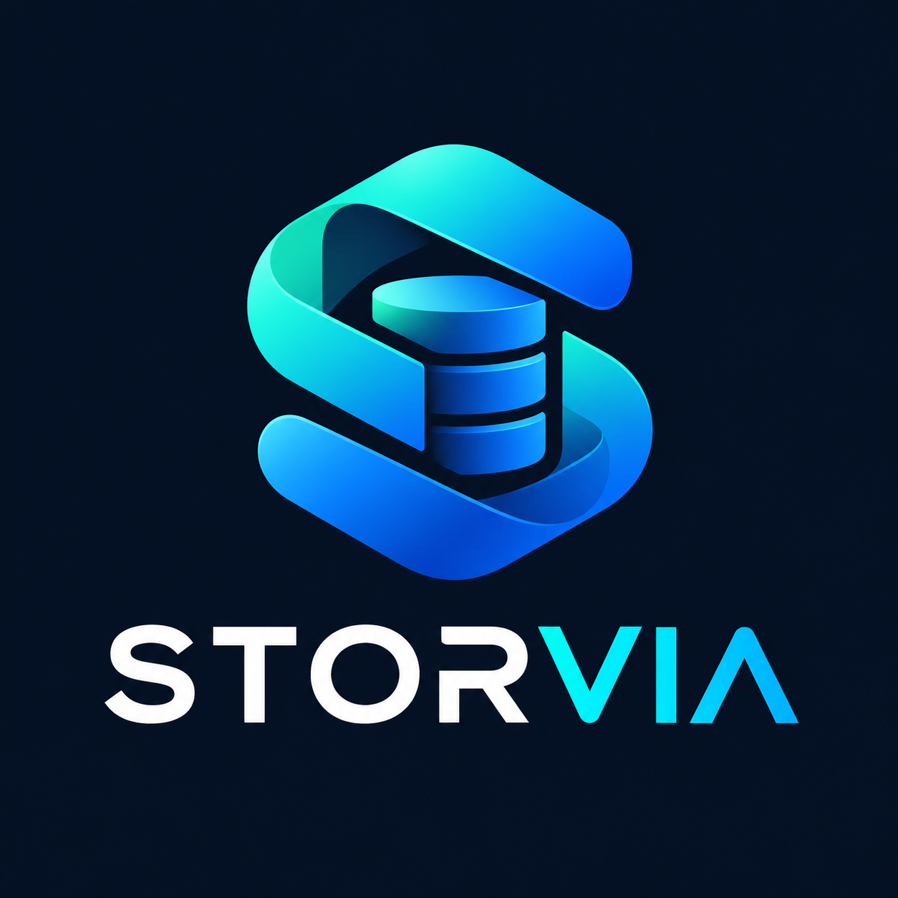

> [!NOTE]
> **Storvia is an independent fork of [minio/minio](https://github.com/minio/minio) (archived April 2026).**
> It is not affiliated with or endorsed by MinIO, Inc.
> Issues and contributions are welcome at [ergin84/storvia](https://github.com/ergin84/storvia/issues).

---

# Storvia

**Open Source S3-Compatible Object Storage**

[](https://github.com/ergin84/storvia/issues)
[](https://hub.docker.com/r/erginmehmeti/storvia)
[](https://github.com/ergin84/storvia/blob/master/LICENSE)



Storvia is a community-maintained object storage server based on the open-source MinIO codebase.
It provides S3-compatible storage with continuing community-driven maintenance, security updates, bug fixes, and improvements.

Storvia is an independent project and is **not affiliated with or endorsed by MinIO, Inc.**

- **S3 API Compatible** — works with all S3-compatible tools and SDKs
- **Drop-in replacement** — compatible with existing MinIO data directories and credentials
- **Active maintenance** — security patches, dependency updates, and community bug fixes
- **Multi-architecture** — Linux amd64 and arm64 binaries and Docker images

---

## Quick Start

### Docker (recommended)

```sh
docker run -d \
  --name storvia \
  -p 9000:9000 \
  -p 9001:9001 \
  -e MINIO_ROOT_USER=admin \
  -e MINIO_ROOT_PASSWORD=change-this-password \
  -v storvia-data:/data \
  erginmehmeti/storvia:latest \
  server /data --console-address ":9001"
```

Then open the web console at <http://localhost:9001>.

### Install from source

Requires [Go 1.26+](https://golang.org/dl/#stable).

```sh
go install github.com/ergin84/storvia@latest
storvia server /data --console-address ":9001"
```

### Pre-built binaries

Download from [GitHub Releases](https://github.com/ergin84/storvia/releases):

| Platform | Architecture | Download |
|---|---|---|
| Linux | amd64 | `storvia-linux-amd64` |
| Linux | arm64 | `storvia-linux-arm64` |
| macOS | amd64 | `storvia-darwin-amd64` |
| macOS | arm64 | `storvia-darwin-arm64` |
| Windows | amd64 | `storvia-windows-amd64.exe` |

Verify checksums with the accompanying `checksums.sha256` file.

---

## Features

- **S3 API** — full compatibility with Amazon S3 object storage operations
- **Erasure coding** — data protection across single and distributed deployments
- **IAM** — users, groups, policies, service accounts
- **Bucket policies** — fine-grained access control
- **Versioning** — object version history
- **Replication** — site-to-site and bucket-level replication
- **Encryption** — server-side encryption with KMS integration
- **Object lifecycle** — expiration and tiering rules
- **Multipart uploads** — large object support
- **FTP/SFTP** — optional file transfer protocol access
- **Prometheus metrics** — built-in observability

---

## Kubernetes / Helm

Install the Storvia Helm chart from the OCI registry:

```sh
helm install storvia \
  oci://ghcr.io/ergin84/storvia \
  --version <version> \
  --namespace storvia \
  --create-namespace \
  --set rootUser=admin \
  --set rootPassword=change-this-password
```

See [`helm/storvia/`](helm/storvia/) for chart documentation and configuration options.

**Migrating an existing `helm/minio` installation?** See [MIGRATION.md](MIGRATION.md).

---

## Configuration

Storvia uses the same environment variables as upstream MinIO. These are preserved for full backwards compatibility.

| Variable | Description |
|---|---|
| `MINIO_ROOT_USER` | Root user name (default: `minioadmin`) |
| `MINIO_ROOT_PASSWORD` | Root password (default: `minioadmin`) |
| `MINIO_VOLUMES` | Storage path(s) |
| `MINIO_SERVER_URL` | Public server URL |
| `MINIO_BROWSER_REDIRECT_URL` | Console redirect URL |

All `MINIO_*` variables accepted by upstream MinIO continue to work unchanged.

---

## Compatibility

Storvia is designed as a **drop-in replacement** for community edition MinIO.

- Existing data directories are read without migration
- Existing `MINIO_*` environment variables are honoured
- Existing S3 API clients continue to work without changes
- Existing bucket policies, IAM users, and credentials are preserved
- The `minio` binary symlink is included in the container image for backwards compatibility

> **On-disk format identifiers** (`.minio.sys`, `xl.meta`, `format.json`) are intentionally unchanged to ensure data compatibility.

---

## Migration from MinIO

### From `erginmehmeti/minio` or upstream `minio/minio`

1. Stop the existing container or binary.
2. Your data volume requires no changes.
3. Replace the image name with `erginmehmeti/storvia`:

```sh
docker run -d \
  --name storvia \
  -p 9000:9000 \
  -p 9001:9001 \
  -e MINIO_ROOT_USER=<your-existing-root-user> \
  -e MINIO_ROOT_PASSWORD=<your-existing-root-password> \
  -v <your-existing-volume>:/data \
  erginmehmeti/storvia:latest \
  server /data --console-address ":9001"
```

4. Verify with `mc admin info local`.

See [MIGRATION.md](MIGRATION.md) for detailed instructions including Helm and Kubernetes migrations.

---

## Building from source

```sh
git clone https://github.com/ergin84/storvia.git
cd storvia
make build
./storvia server /tmp/test-data --console-address ":9001"
```

---

## Security

Security bugs should be reported by email to **erginmehmeti@gmail.com**.
See [SECURITY.md](SECURITY.md) for the full disclosure policy.

---

## Contributing

Contributions are welcome. See [CONTRIBUTING.md](CONTRIBUTING.md).

---

## Support

Support is provided on a best-effort basis through [GitHub Issues](https://github.com/ergin84/storvia/issues).
There are no SLAs or commercial support offerings at this time.

---

## License and Attribution

- Source code is licensed under the [GNU AGPLv3](LICENSE).
- Storvia is based on [minio/minio](https://github.com/minio/minio), originally developed by MinIO, Inc.
- MinIO is a trademark of MinIO, Inc. Storvia is an independent community project and is not affiliated with MinIO, Inc.
- [Documentation](docs/) is licensed under [CC BY 4.0](https://creativecommons.org/licenses/by/4.0/).
- See [CREDITS](CREDITS) and [NOTICE](NOTICE) for third-party acknowledgements.
